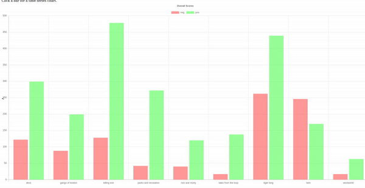
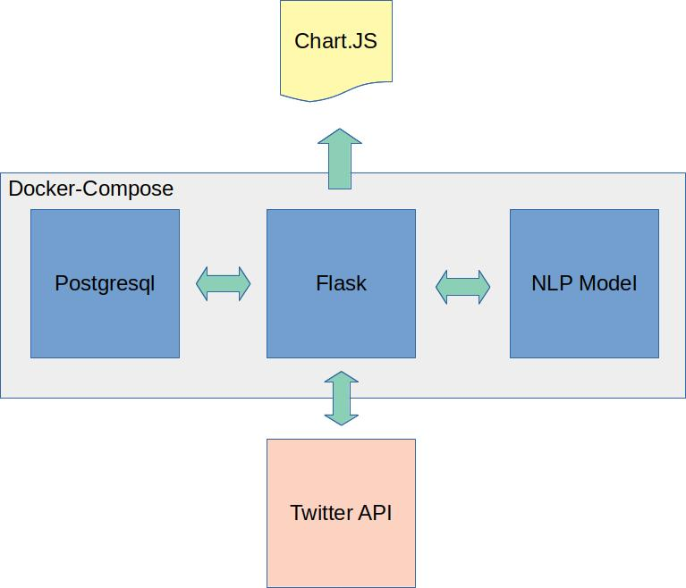

# tv_sentiment

A deep learning nlp approach to deciding what to watch...

## Overview

My aims were:
* Train and use an NLP model in an application and explain the output
* Build a Docker based application to learn how
* Find some new shows to watch!

## Architecture

### Database

A standard Postgressql database container. The data volume was created separtely in order that it can be used outside the docker-compose instance. The server interacted via SQLAlchemy models to make it independent of the underlying database type. 

### Web server / App Controller

A Flask server to query the database & twitter and interact with the user via a web browser. The server also communicated with the NLP engine over the internal compose network.

### NLP Engine

This was kept separate in order that it could be swapped for a different model easily as needed. The model uses the ULMFit RNN based approach from [Fastai](https://www.fast.ai/). It has been pre-trained on the WikiText103 dataset and then trained on the IMDB dataset (achieving 94% accuracy on that classification problem), learning from these, general english language understanding and screen entertainment reviewing respectively.

## Explaining the results

### Issues Encountered

* At the time of writing Docker-Compose did not have GPU pass through support. Initially I ran the NLP engine in a separate docker container with GPU pass through (available in Linux) then converted the model to default to CPU. This seemed more in line with a production system where CPUs are plentiful (for scaling) and the model is only doing the forward pass.
* Persistant database storage that could be accessed outside the docker container for development.
  * This was solved be pre-defining a data volume for docker that could be mapped into the compose group or into a standalone container.

## Output

The output charts all use the [Chart JS](https://www.chartjs.org/ "Chart JS") library. Custom functions were written to turn dataframes into correctly formatted JSON.

## Limitations

* Off topic tweets - occur particularly when the show name has other meanings. The service provider for each show was also added the search parameters to try and reduce this. E.g. "killing eve + bbc". A clustering algorithm / embedding distance search may be able reduce this further.

## Future Ideas

* Starlette for asynchronous web serving
* FastAPI for API development / serving

## TV Suggestions

I highly recommend 'DEVS' from the BBC!
